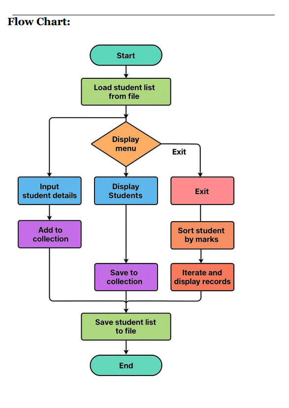

# Student Record Management System

A Java-based Student Record Management System with persistent storage using file handling and Java Collections Framework.

## Features

- Load student records from file at startup
- Add new student records
- View all students
- Search students by name
- Delete students by name
- Sort students by marks (descending order)
- Sort students by name (alphabetical order)
- Save records to file on exit
- Display file attributes
- Random access file demonstration

## Class Structure

### Student.java
- Represents a student record with rollNo, name, email, course, and marks
- Implements `Comparable` interface for natural ordering by name
- Provides methods for file format conversion and display

### FileUtil.java
- Handles file operations (read/write)
- Uses `BufferedReader` and `BufferedWriter` for efficient I/O
- Implements `RandomAccessFile` for random access demonstration
- Displays file attributes using `File` class

### StudentManager.java
- Manages student collection using `ArrayList`
- Implements sorting using `Comparator`
- Uses `Iterator` for displaying and deleting records
- Provides CRUD operations for student records

### Main.java
- Entry point of the application
- Provides interactive menu-driven interface
- Handles user input validation

## How to Run

1. Compile all Java files:
```bash
javac *.java
```

2. Run the application:
```bash
java Main
```

## Sample Data Format

The `students.txt` file uses CSV format:
```
rollNo,name,email,course,marks
101,Ankit,ankit@mail.com,B.Tech,85.5
102,Riya,riya@mail.com,M.Tech,91.0
```

## Menu Options

1. **Add Student** - Input new student details
2. **View All Students** - Display all students using Iterator
3. **Search by Name** - Find students by name
4. **Delete by Name** - Remove student records by name
5. **Sort by Marks** - Sort and display students by marks (highest first)
6. **Save and Exit** - Save all changes and exit the program
7. **Sort by Name** - Sort and display students alphabetically
8. **Display File Attributes** - Show file information
9. **Random Access File Demo** - Demonstrate random file access

## Flow Chart


*Application flow diagram showing the complete workflow*

## Technical Implementation

### Collections Used
- `ArrayList<Student>` for storing student records
- `Iterator` for traversing collections
- `Comparator` for custom sorting by marks
- `Comparable` for natural ordering by name

### File Handling
- `BufferedReader` for reading student data
- `BufferedWriter` for writing student data
- `RandomAccessFile` for random access operations
- `File` class for file attributes

### Error Handling
- Input validation for numeric fields
- File I/O exception handling
- Number format exception handling
- Graceful error messages

## Learning Outcomes

This assignment demonstrates:
1. File handling for persistent storage
2. Java Collections Framework (List, Iterator)
3. Sorting with Comparator and Comparable interfaces
4. Object-oriented programming principles
5. Exception handling
6. User input validation
7. Menu-driven application design

## Author

Varun

## Date

November 21, 2025
